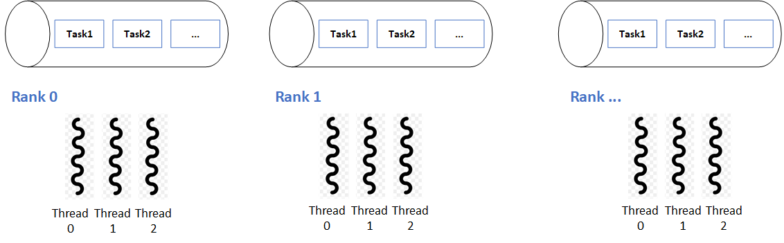

## Try a distributed mxm-task queue with HCL
Assume the usecase, we have multiple ranks running on distributed memory machines, each rank has a queue of tasks and multiple execution threads inside. Task could be defined as a data tuple of matrices, for example:
```C
typedef struct Mattup_StdArr_Type {
    int tid;
    std::vector<double> A;
    std::vector<double> B;
    std::vector<double> C;

    // constructors
    Mattup_StdArr_Type(): A(), B(), C() {}
    Mattup_StdArr_Type(int id, int val):
            tid(id),
            A(SIZE * SIZE, val),
            B(SIZE * SIZE, val),
            C(SIZE * SIZE, val) { }

} Mattup_StdArr_Type;

// serialization as thallium does
#if defined(HCL_ENABLE_THALLIUM_TCP) || defined(HCL_ENABLE_THALLIUM_ROCE)
    template<typename A>
    void serialize(A &ar, Mattup_StdArr_Type &a) {
        ar & a.tid;
        ar & a.A;
        ar & a.B;
        ar & a.C;
    }
#endif
```
A, B, C as the fixed-sized arrays with SIZE. Instead of creating separate queues on separate ranks, we try to create an HCL-global queue of Mattup_StdArr_Type type objects. In further, for the scanario as task-stealing, the current rank could easily get the task from other ranks, and put back later on.

<p align="left">
  
</p>