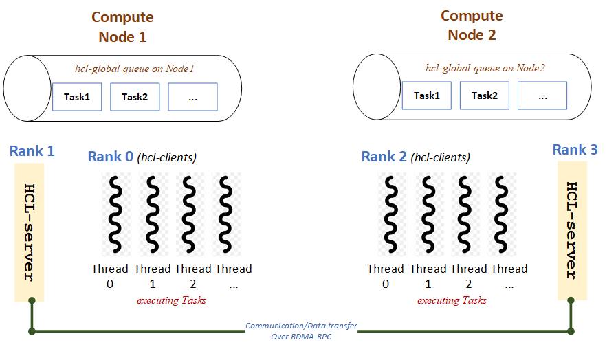

## A prototype for task-stealing with HCl-distributed queues
Assume the usecase, we have multiple ranks running on distributed memory machines/nodes, each node has a global queue of tasks and multiple execution-threads per rank. Task could be defined as a data tuple of matrices and the payload is mxm kernel (i.e., mxm-multiplication), for example:
```C
typedef struct MatTup_Type {
    int tid;
    std::vector<double> A;
    std::vector<double> B;
    std::vector<double> C;

    // constructors
    MatTup_Type(): A(), B(), C() {}
    MatTup_Type(int id, int val):
            tid(id),
            A(SIZE * SIZE, val),
            B(SIZE * SIZE, val),
            C(SIZE * SIZE, val) { }
    ...
} MatTup_Type;

// serialization as thallium does
#if defined(HCL_ENABLE_THALLIUM_TCP) || defined(HCL_ENABLE_THALLIUM_ROCE)
    template<typename A>
    void serialize(A &ar, MatTup_Type &a) {
        ar & a.tid;
        ar & a.A;
        ar & a.B;
        ar & a.C;
    }
#endif
```
A, B, C as the fixed-sized vectors with SIZE before the execution. Instead of creating separate queues on separate ranks, we try to use an HCL-global queue of MatTup_Type objects per node. For the scanario of task-stealing on distributed memory machines/nodes, one global-tasks queue per node, the tasks on remote nodes could be stolen when the current queue is empty and returned back later on. Such a prototype, the design could be simply as follow with HCL:

<p align="left">
  
</p>